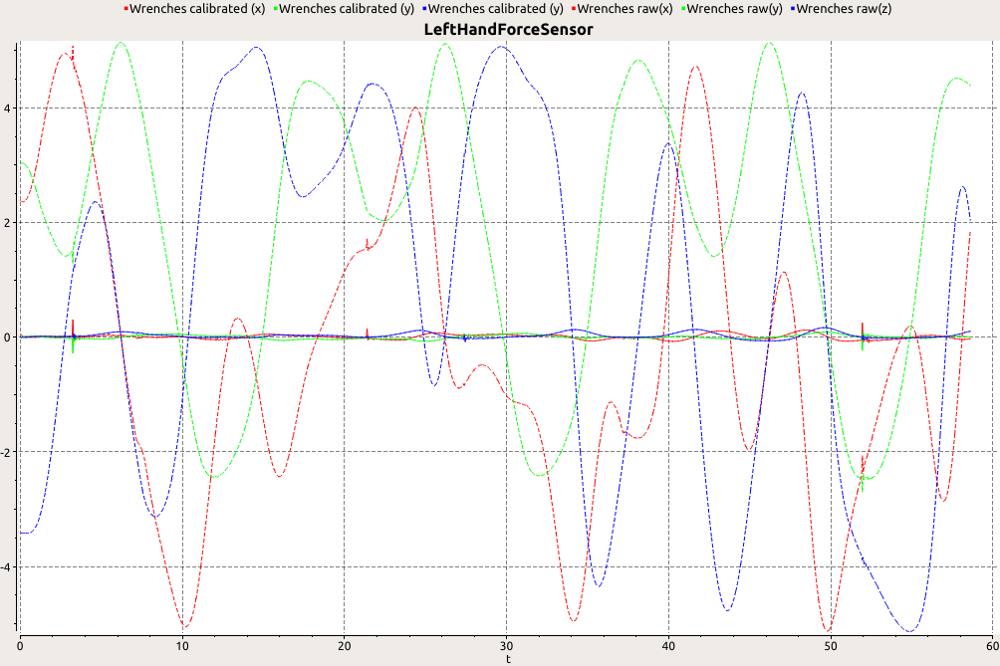

Force Sensor Calibration
==

This controller allows to calibrate robot force sensors to allow `mc_rtc` to remove the effect of gravity due to links attached to the force sensors (grippers/feet).

Robots currently supported:
- `HRP4LIRMM`
- `HRP4J`
- `HRP2DRC`
- `HRP5P`
- `JVRC1`
- `panda_default`

To add your own robot, see the [Adding your own robot/configuration](#adding-your-own-robot) section below.

Requirements
==

Running this controller requires:
- [Ceres library](https://github.com/ceres-solver/ceres-solver)
  Note: On ubuntu 16.04 you need [ceres 1.14](https://github.com/ceres-solver/ceres-solver/tree/1.14.x)
- [mc_rtc](https://github.com/jrl-umi3218/mc_rtc)
- `C++14`

How to use
==

To calibrate, simply run this controller and follow the instructions in the GUI.

```yaml
MainRobot: JVRC1 # one of the supported robots
Enabled: ForceSensorCalibration
```

- As a safety, the controller will first check that none of the sensor readings are above a specified threshold (ensures that floating base robots are in the air)
  - If the test fails, it'll display a message in the GUI. Click on `Continue` once the robot is in the air
- Then you will be presented with a `Calibration` tab in the GUI:
  - **Start calibration**: perform the calibration motion (going to an initial posture, and making each sensor move simultaneously. Once the motion is completed, it'll run the calibration optimization, and move to the next `Check calibration` state
  - **Check calibration**: loads the calibration results, perform the calibration motion again and displays live plots of the results. The calibrated force is expected to be close to `0N`. You can either save the current calibration results if you are satisfied using `Save calibration` or `Save and finish`, or stop without keeping the calibration results using `Finish without saving`. Note that saving might fail if you don't have the writing rights to the calibration directory.
  - **Show forces**: offers a GUI tab to display forces as arrows/live plots
  - Once the check calibration state is finished, the robot will go back to halfsitting.
  - If there is an error, the robot will go back to halfsitting.

The expected result in the live plots should look similar to (dotted is the raw uncalibrated sensor measurement, solid is the calibrated force with gravity removed which should be close to zero)




Note for simulation
==

For floating base robots, you need to have the robot in the air. In choreonoid, this can be achieved by changing the root joint type to `fixed` in the robot's `wrl` model.
For convenience, we provide `*_fixed.cnoid` variants of our main robots (`JVRC1`, `HRP4LIRMM`, `HRP4J`, `HRP5P`), use these variants to run the calibration controller in simulation.

TroubleShooting
==

**HRP4**:

Currently the real HRP4 has a force sensor with reading flipped along one of its axis. As a result, the choreonoid simulation and reality must be configured differently:

- Choreonoid:
  - Use `*_fixed.cnoid`
  - Don't forget to use the robot module `HRP4ComanoidChoreonoid` to have the correct force sensor frames

- Real
  - Use `HRP4Comanoid` robot module

Adding your own robot
==

To add your own robot, you should add an additional section with the same name as that of your robot in `etc/ForceSensorCalibration.in.yaml` and sumbit a pull request. Here is a brief summary of the yaml configuration parameters.

- `ObserverPipelines`: a state observation pipeline see [here](https://jrl-umi3218.github.io/mc_rtc/json.html#Observers/ObserverPipelines) for supported options. The calibration method requires the orientation of force sensors w.r.t gravity to be known. For floating base robots this means that you need to know at least the orientation of the floating base w.r.t gravity (roll/pitch), and the joint position in order to compute the sensor frame orientation from kinematics.
- `forceSensors`: Vector of force sensor names to calibrate
- `initialGuess`: [optional] Map of force sensor names to initial calibration parameters
  ```yaml
  initialGuess:
    LeftHandForceSensor:
      com: [0, 0, -0.1]
      mass: 0.3
      rpy: [0,0,0]
      offset: [0,0,0,0,0,0]
    RightHandForceSensor:
      ...
  ```
  If no initial guess are provided, one will be automatically computed from the robot model. This assumes that the children links of the link to which the force sensor is attached contain the correct mass and inertia.
- `maxPressureThreshold`: Prevent calibration motion if any of the force sensors measures more than this threhold (norm of force).
- `initial_posture`: Initial robot posture from which the calibration motion starts.
  ```yaml
  initial_posture:
    completion:
      eval: 0.06
    target:
      L_HIP_R: [0.25]
      R_HIP_R: [-0.25]
  ```
- `motion`: The calibration motion should move the joints prior to the force sensor and attempt to put the force sensor in as many orientations as possible. This section makes each joint move in a sinusoidal motion within the joint limits (or subrange of).
  ```yaml
  motion:
    duration: 30
    stiffness: 10  # posture task stiffness
    percentLimits: 0.8  # percentage of joint limits for all joints
    joints:
    - name: R_ANKLE_P
      period: 10
    - name: L_ANKLE_P
      period: 15
    - name: R_ANKLE_R
      period: 10
      percentLimits: 0.5 # per-joint limits (optional)
    - name: L_ANKLE_R
      period: 15
  ```
- `verboseSolver` [default=`false`]: When true show per-iteration results of the solver
- `SinglularityThreshold`: Prevents singular configuration (useful for fixed-based robots)
  - `0` disables this feature
